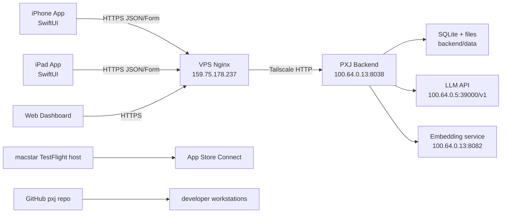
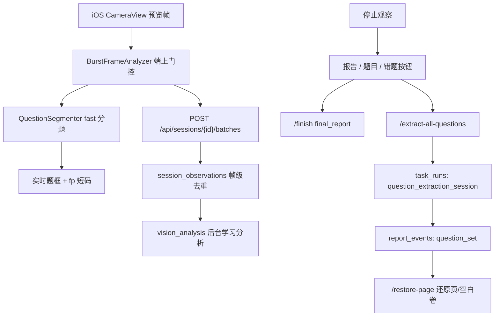

# 知进拍学架构文档

## 代码目录

```text
backend/
  app/
    main.py              FastAPI 入口、API、任务调度、QA 主流程
    config.py            PXJ_* 环境变量和默认配置
    db.py                SQLite schema、账号控制库、账户分库
    llm.py               OpenAI-compatible 文本/视觉调用
    embeddings.py        语义向量调用与相似度
    memory_store.py      长期记忆检索、写入、画像整理
    prompts.py           提示词定义、覆盖、校验、重置
    intent_router.py     自然语言配置意图草案
    static/              Web dashboard、提示词和资产页面
  docker-compose.yml     生产容器入口，宿主端口 8038
ios/
  project.yml            XcodeGen 工程定义
  PXJ.xcodeproj/         由 project.yml 生成的 Xcode 工程
  PXJ/App/
    ContentView.swift    主 AppState、网络、学习/拍题/语音/复习 UI
    Auth.swift           登录、注册、Keychain、认证状态
    PXJApp.swift         App 入口和 UI test 自动登录钩子
    iPad/                iPad 分栏体验
    Memory/              学习画像和记忆组件
    Intent/              意图配置模型与卡片
  PXJUITests/            iPhone/iPad XCUITest 冒烟
deploy/nginx/
  pxj.evowit.com         VPS Nginx 反代配置
scripts/
  clear_operational_data.py
  ios-sim-smoke.sh
docs/
  *.md                   当前项目文档
```

## 运行时架构



## 后端分层

- API 层：`main.py` 挂载 FastAPI routes，处理鉴权、上传、会话、QA、错题、提示词、日志。
- 配置层：`config.py` 使用 `PXJ_` 前缀，避免和旧项目环境变量互相污染。
- 数据层：`control.sqlite3` 存账号和全局控制信息；`data/accounts/<account_id>.sqlite3` 存单账号学习数据。
- 文件层：`data/images`、`data/thumbnails`、`data/visualizations` 存上传图、缩略图和教学可视化。
- 模型层：`llm.py` 调默认 OpenAI-compatible API；`embeddings.py` 负责语义向量。
- 记忆层：`memory_store.py` 负责检索、加权、写入、状态更新和整理。

## 智能观察提题链路



- 实时框选只依赖端上 OCR/分题，不消耗 VLM。
- 整轮题目提取只处理会话里非 `invalid/duplicate` 的关键图，走后台优先级。
- `question_set` 仍保存在 `report_events`；未来需要来源证据、短题图像哈希和 seen_count 时，再迁移到 `session_question_observations`。
- 后台任务通过 `/api/tasks` 暴露给 iOS 任务浮层，可查看排队/运行并取消。

## iOS 分层

- `PXJApp.swift`：App 入口、测试环境自动登录。
- `Auth.swift`：认证、Keychain、服务器配置。
- `ContentView.swift`：当前仍是最大聚合文件，包含 AppState、网络封装、拍题/答疑/复习主流程。
- `iPad/*`：iPad 专用导航与大屏页面。
- `Memory/*`：记忆与画像 UI。
- `Intent/*`：自然语言配置提案 UI。

## 数据隔离

- 新项目默认数据库：`pxj.sqlite3` 只作为旧兼容路径；当前实际使用 `control.sqlite3` 和 `accounts/*.sqlite3`。
- 新服务容器名：`pxj`。
- 新 compose project：`pxj`。
- 新宿主端口：`8038`。
- 新 iOS bundle id：`com.linyibin8.pxj`。
- 新 keychain service：`com.linyibin8.pxj.auth`。
