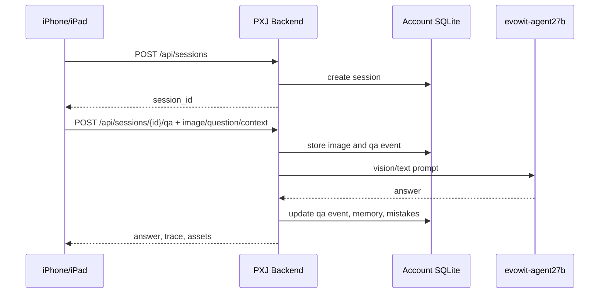
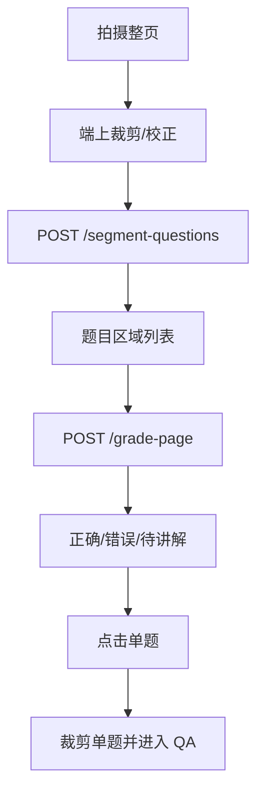
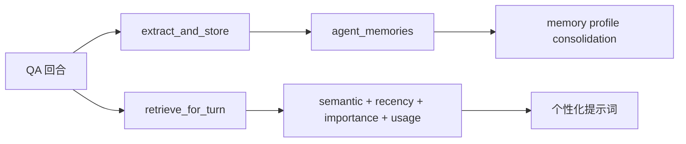
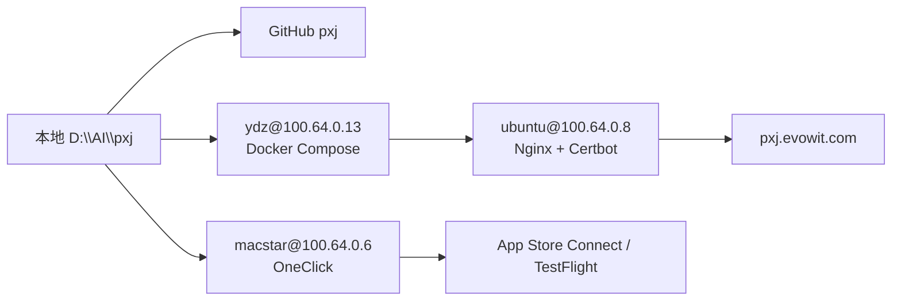
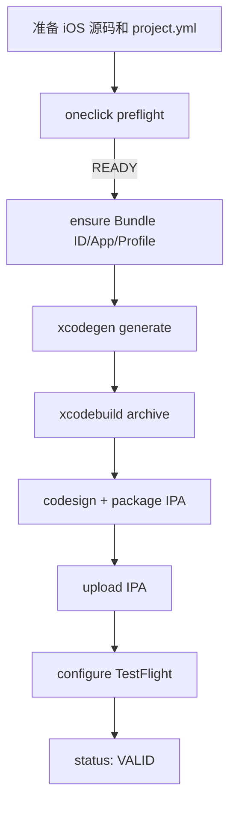

# 知进拍学流程图

## 拍题答疑

```mermaid
sequenceDiagram
  participant App as iPhone/iPad
  participant API as PXJ Backend
  participant DB as Account SQLite
  participant LLM as evowit-agent27b

  App->>API: POST /api/sessions
  API->>DB: create session
  API-->>App: session_id
  App->>API: POST /api/sessions/{id}/qa + image/question/context
  API->>DB: store image and qa event
  API->>LLM: vision/text prompt
  LLM-->>API: answer
  API->>DB: update qa event, memory, mistakes
  API-->>App: answer, trace, assets
```

## 整页批改

```mermaid
flowchart TD
  A["拍摄整页"] --> B["端上裁剪/校正"]
  B --> C["POST /segment-questions"]
  C --> D["题目区域列表"]
  D --> E["POST /grade-page"]
  E --> F["正确/错误/待讲解"]
  F --> G["点击单题"]
  G --> H["裁剪单题并进入 QA"]
```

## 长期记忆

```mermaid
flowchart LR
  QA["QA 回合"] --> Extract["extract_and_store"]
  Extract --> Memories["agent_memories"]
  QA --> Retrieve["retrieve_for_turn"]
  Retrieve --> Weight["semantic + recency + importance + usage"]
  Weight --> Prompt["个性化提示词"]
  Memories --> Profile["memory profile consolidation"]
```

## 部署链路

```mermaid
flowchart LR
  Dev["本地 D:\\AI\\pxj"] --> GitHub["GitHub pxj"]
  Dev --> Backend["ydz@100.64.0.13\nDocker Compose"]
  Backend --> VPS["ubuntu@100.64.0.8\nNginx + Certbot"]
  VPS --> Domain["pxj.evowit.com"]
  Dev --> Mac["macstar@100.64.0.6\nOneClick"]
  Mac --> TF["App Store Connect / TestFlight"]
```

## 发布流程

```mermaid
flowchart TD
  A["准备 iOS 源码和 project.yml"] --> B["oneclick preflight"]
  B -->|READY| C["ensure Bundle ID/App/Profile"]
  C --> D["xcodegen generate"]
  D --> E["xcodebuild archive"]
  E --> F["codesign + package IPA"]
  F --> G["upload IPA"]
  G --> H["configure TestFlight"]
  H --> I["status: VALID"]
```
