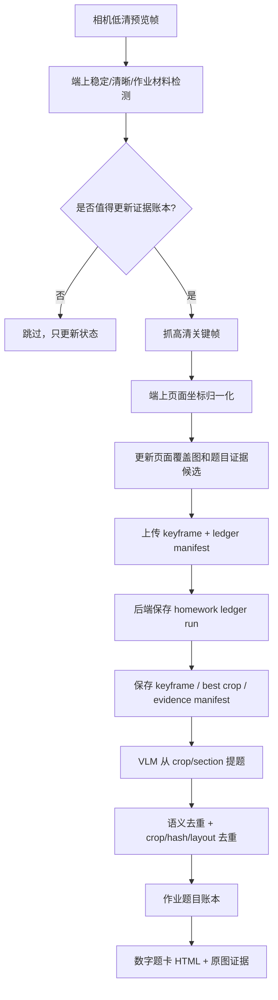

# 作业证据账本独立功能方案

## 一句话目标

新建一个独立的“作业证据账本”功能：摄像头持续低成本观察，但只在出现新题、新页面区域、更清晰证据或学生新增书写时抓取关键帧；停止观察后，把本回合所有题目汇总成可编辑数字版，并为每题保留最佳原图证据。

这不是继续优化旧的“单帧分题”链路，而是把系统目标改成：在一轮作业过程中稳定收集足够证据，最后生成完整、去重、可追溯的题目集。

## 目标

- 拍得少：只在稳定、新变化、证据更好时抓高清关键帧。
- 传得少：默认只传关键帧和 rect/ledger manifest，不重复传 crop JPEG。
- 不漏题：用多帧覆盖图和 section crop 兜底，不把单帧分题准确率当唯一成败点。
- 重复题自动合并：同一区域多次出现、同题多帧出现，只进入一个题目证据条目。
- 每题都有最佳证据图：保留最清晰、遮挡最少、边界最完整的一张 canonical crop。
- 数字版可编辑：题干、选项、公式转成 HTML/LaTeX，可编辑修正。
- 几何/图形先保存局部位图，逐步矢量化：不强行重画；先保留 figure crop，再逐步生成 SVG/几何 primitives。

## 为什么要独立做

现有链路已经做了端上 OCR 分题、rect-only crop、后端 VLM 提题、题目去重和还原页，但体验风险仍在：

- 大模型能读题，却不稳定知道每道题在整图的具体方位。
- 端上单帧分题边界容易受题型、版式、拍摄角度影响。
- 短题、几何题、图形题靠文字指纹容易误合并或漏合并。
- YOLO/Core ML 检测器训练过，但当前数据规模和误检率不适合接管主流程。
- 旧路径容易得到“很干净但题目太少”的结果。

因此新功能必须和旧功能并行，单独入口、单独数据、单独验收指标。旧提题链路继续保留，新链路先用 Mac 模拟和 TestFlight 灰度验证。

## 产品形态

### iOS 新入口

建议新建入口名：

```text
作业观察实验版
```

入口行为：

1. 用户点开始，摄像头进入低功耗观察。
2. 屏幕只显示轻量状态：已见页面区域、关键帧数、候选题证据数、当前是否稳定。
3. 系统自动抓关键帧，不要求用户逐题拍。
4. 用户点停止后，后台汇总本回合题目。
5. 完成后展示：
   - 本回合题目数；
   - 每题数字版；
   - 每题最佳证据图；
   - 未确认/含图/低置信题提醒；
   - 可编辑题卡。

### 用户可见结果

每道题以题卡展示：

```text
题号 / 学科 / 类型 / 置信度
可编辑数字题干
选项 / 填空 / 公式
图形证据 crop
来源证据：第几张关键帧、出现次数、清晰度
```

含图题不要默认重画。展示策略：

- 第一版：嵌入局部位图。
- 第二版：尝试生成 SVG 草稿，但必须可对照原图。
- 第三版：支持点、线、圆、角标、阴影区域等 primitives 编辑。

## 总体架构



## 核心概念

### Page Episode

一段连续观察同一页或同一区域的时间。翻页、移动到新题区、视角大变化时开启新的 page episode。

字段建议：

```json
{
  "id": "page_ep_001",
  "session_id": "obs_123",
  "started_at": "...",
  "ended_at": "...",
  "page_fingerprint": "...",
  "coverage_map": {},
  "best_frame_id": "frame_018"
}
```

### Evidence Frame

真正保存和上传的关键帧，不是每个预览帧。

触发原因：

- 新页面或新区域出现；
- 当前画面比历史证据更清晰；
- 旧区域有新增书写；
- coverage map 有空洞；
- 风险区域需要 section fallback；
- 翻页或大幅移动。

字段建议：

```json
{
  "id": "ev_frame_018",
  "page_episode_id": "page_ep_001",
  "sequence": 18,
  "reason": "new_region|better_quality|student_write|coverage_gap|page_turn",
  "sharpness": 0.91,
  "brightness": 0.74,
  "occlusion": 0.04,
  "image_filename": "..."
}
```

### Question Evidence

题目的证据条目。它不是最终题目，而是“这个区域/这组证据可能代表一道题”。

字段建议：

```json
{
  "id": "qev_003",
  "page_episode_id": "page_ep_001",
  "canonical_rect": {"x": 0.08, "y": 0.22, "w": 0.82, "h": 0.16},
  "best_frame_id": "ev_frame_018",
  "best_crop_filename": "qev_003_crop.jpg",
  "crop_hash": "...",
  "layout_key": "page1:y22:h16",
  "ocr_key": "3_求阴影面积",
  "seen_count": 5,
  "status": "candidate|ready|extracted|merged|needs_review",
  "quality": {
    "sharpness": 0.91,
    "coverage": 0.86,
    "occlusion": 0.04
  }
}
```

### Question Card

最终给用户看的题目。

```json
{
  "id": "q_003",
  "evidence_ids": ["qev_003", "qev_008"],
  "number": "3",
  "stem_html": "...",
  "stem_text": "...",
  "choices": [],
  "math_latex": [],
  "figure_assets": [
    {
      "type": "raster",
      "filename": "q_003_figure.jpg",
      "source_evidence_id": "qev_003"
    }
  ],
  "editable_html": "<article contenteditable=\"true\">...</article>",
  "confidence": 0.82,
  "review_flags": ["has_figure"]
}
```

## 端上策略

### 预览帧只做低成本判断

每 500-1000ms 抽一张低清帧，计算：

- 是否稳定：连续帧全局变化低；
- 是否清晰：Laplacian/edge score；
- 是否有学习材料：纸张、文本、矩形、亮度、纹理；
- 是否遮挡：手/大面积运动/模糊；
- 是否新区域：和当前 page coverage map 对比；
- 是否新增书写：局部变化集中在已知作答区域。

### 高清关键帧触发

只在满足条件时抓高清：

```text
稳定 >= 1.0s
+ 清晰度超过阈值
+ 有学习材料
+ 命中以下任一：
   - 新页面
   - 新题区
   - 覆盖图空洞
   - 当前帧质量明显优于历史最佳
   - 学生新增书写
   - 停留超过保底间隔
```

保底间隔建议 8-15 秒，防止低成本判断漏掉缓慢变化。

### 上传策略

第一阶段：

- 上传高清关键帧 JPEG；
- 上传 ledger manifest；
- 上传每题最佳证据 crop JPEG；
- 不上传重复帧、不上传整段视频；
- manifest 里写候选 rect、质量、触发原因和合并关系。

后端先做独立存储、查回、HTML 回看和资产管理。后续如果端上只传 rect，也可以由后端从关键帧生成 crop。

## 后端策略

### 新表建议

先不要改旧 `question_set` 主流程。新增实验表：

```sql
homework_ledger_runs
homework_ledger_frames
homework_ledger_page_episodes
homework_ledger_evidence
homework_ledger_cards
```

### 后端处理阶段

1. 创建独立 homework ledger run。
2. 保存 keyframe、best crop 和 manifest。
3. 按 page episode / evidence / card 查回。
4. 用 `input_index` 绑定来源，不让 VLM 自己定位原图。
5. 用文本指纹、crop hash、layout key 合并。
6. 为每题选最佳证据图。
7. 生成数字题卡 HTML。
8. 后续再补后端 rect-only crop 生成和后台 VLM 任务。

### 提题输入优先级

```text
1. high-confidence question crop
2. section crop with input_index binding
3. full-frame fallback only when coverage suspicious
```

full-frame fallback 只能兜底，不能作为常态路径。

## 非文字内容策略

### 几何图

第一版：

- 裁出 figure crop；
- 题卡中嵌入局部位图；
- `figure_note` 写清楚“图形见证据图”；
- 不强行重画。

第二版：

- 识别点名、线段、圆、角标、数字标注；
- 生成 `geometry_primitives`；
- 渲染 SVG 草稿；
- 保留原图对照。

第三版：

- 用户可拖动点、改标签、补线；
- 保存 SVG/primitives 作为可编辑图形。

### 表格/坐标图/函数图

- 能可靠结构化时转 HTML table / SVG axis；
- 不可靠时保留 raster crop；
- 结构化结果必须附带 source crop。

### 手写答案

- 作为 answer evidence layer 保存；
- 不混入印刷题干；
- 可用于错题判断，但不污染数字题卡。

## Mac 模拟闭环

先不依赖真机摄像头，做本地模拟器：

```text
input: 一个文件夹，里面是连续相机帧/历史照片
output:
  frames.jsonl
  page_episodes.json
  question_evidence.json
  question_cards.json
  index.html
  metrics.json
```

建议脚本：

```text
scripts/homework_evidence_ledger_sim.py
```

模拟内容：

- 读取连续帧；
- 按 pHash/清晰度/变化量选关键帧；
- 生成 page episode；
- 生成 question evidence 候选；
- 调后端或本地 VLM 做题目提取；
- 输出可编辑 HTML 题卡；
- 统计拍照数、上传字节、题目召回、重复率。

Mac 模拟验收：

- 同一页停留 30 秒，不超过 3 张关键帧；
- 页面缓慢移动时，coverage map 能补齐新区域；
- 同一道题多次出现，只生成一个 question card；
- 每个 question card 都有 best crop；
- 含图题不会被纯文字错误合并；
- `index.html` 能人工检查和编辑。

## TestFlight 灰度门槛

进入 TestFlight 前必须满足：

- 新功能入口独立，不影响现有拍题/观察。
- 实验数据独立表或独立 event type，不污染旧 `question_set`。
- 观察 10 分钟不会明显发热、卡顿或持续高频上传。
- 默认只上传关键帧、ledger manifest 和每题最佳证据 crop，不上传重复帧或整段视频；后续 rect-only 模式可把 crop JPEG 降到 0。
- 停止观察后能生成本轮题目汇总。
- 每题都有 source evidence。
- 低置信/含图题明确标记，不硬重画、不硬判。
- 后台任务可取消、可重试。
- 失败时能回退到“保存证据，稍后处理”，不能丢本轮照片。

## 指标

### 体验指标

- `keyframes_per_minute`
- `upload_bytes_per_minute`
- `time_to_first_question_card`
- `question_card_count`
- `duplicate_merge_count`
- `needs_review_count`

### 质量指标

- 题目召回率：人工参考题数 vs 生成题数。
- 重复率：同题重复 card 数。
- 误合并率：不同题被合并。
- 证据完整率：每题是否有可用 best crop。
- 图形保真率：含图题是否保存局部图形证据。

### 发布硬门槛

第一轮 TestFlight 不要求几何矢量化成功，但必须满足：

- 不漏明显题；
- 不重复刷屏；
- 每题有证据图；
- 数字题卡可编辑；
- 含图题保守显示 crop。

## 分期计划

### Phase 0：方案和模拟器

- 新建方案文档。
- 新建 Mac 模拟脚本。
- 用历史帧输出 evidence ledger HTML。
- 不改 iOS 正式入口。

已落地脚本：

```powershell
python scripts\homework_evidence_ledger_sim.py `
  --demo-from diagnostics\manual-label-sample\images\37f93d7ff705c264_kpai_backend_data_images_00218_98dd5a9c10244f9c_2824936dc65fa6c8.jpg `
              diagnostics\manual-label-sample\images\409126c371e666e6_kpai_backend_data_images_00213_a605c201099aed41_bfb9191df3c52310.jpg `
              diagnostics\manual-label-sample\images\8be712d6396fab1c_dxue_test_images_00038_31ed82e22f6ddc08_75efd590dfb314d1.jpg `
  --demo-variants 4 `
  --out diagnostics\homework-evidence-ledger-sim-smoke `
  --clean
```

该脚本输出：

```text
frames.jsonl
page_episodes.json
question_evidence.json
question_cards.json
metrics.json
index.html
crops/
normalized_frames/
```

Phase 0 smoke 结果：

- synthetic burst：12 帧压到 3 张关键帧，3 个 page episode，9 个 question evidence，模拟上传约 24.4%，crop JPEG 上传为 0。
- crop-f472 图片集：9 张输入保留 9 张关键帧，8 个 page episode，47 个 question evidence，模拟上传约 58.6%，crop JPEG 上传为 0。该输入更像关键图集合，不是连续视频流，因此不作为少拍指标，只验证候选证据输出。

可选 VLM 提题 smoke：

```powershell
python scripts\homework_evidence_ledger_sim.py `
  --demo-from diagnostics\manual-label-sample\images\37f93d7ff705c264_kpai_backend_data_images_00218_98dd5a9c10244f9c_2824936dc65fa6c8.jpg `
              diagnostics\manual-label-sample\images\409126c371e666e6_kpai_backend_data_images_00213_a605c201099aed41_bfb9191df3c52310.jpg `
              diagnostics\manual-label-sample\images\8be712d6396fab1c_dxue_test_images_00038_31ed82e22f6ddc08_75efd590dfb314d1.jpg `
  --demo-variants 4 `
  --out diagnostics\homework-evidence-ledger-vlm-smoke `
  --clean `
  --use-vlm `
  --max-vlm-evidence 1 `
  --vlm-batch-size 1
```

结果：1 个几何 evidence crop 被提取成可编辑数字题卡，`question_type=geometry`，`figure_assets` 保留 raster crop，`svg_draft` 为空，未强行重画几何图；其余 evidence 仍作为 `needs_review + vlm_not_run` 的证据卡保留。

### Phase 1：后端实验 API

已落地独立表：

```text
homework_ledger_runs
homework_ledger_frames
homework_ledger_page_episodes
homework_ledger_evidence
homework_ledger_cards
```

已落地 API：

```text
POST /api/homework-ledger/runs
GET  /api/homework-ledger/runs
POST /api/homework-ledger/runs/{run_id}/sync
POST /api/homework-ledger/runs/{run_id}/finish
GET  /api/homework-ledger/runs/{run_id}
GET  /api/homework-ledger/runs/{run_id}/html
GET  /api/homework-ledger/runs/{run_id}/assets/{asset_path}
```

同步脚本：

```powershell
python scripts\homework_ledger_sync.py `
  diagnostics\homework-evidence-ledger-vlm-smoke `
  --base-url http://127.0.0.1:8765 `
  --run-id http_ledger_smoke_001 `
  --title "HTTP Ledger Smoke"
```

Phase 1 smoke 结果：

```text
create: 200
sync: saved_frames=3, saved_crops=9
manifest_counts: frames=12, page_episodes=3, evidence=9, cards=9
finish: completed
GET /html: 200, contains contenteditable
GET first asset: 200 image/jpeg, 37000 bytes
```

### Phase 2：iOS 实验入口

已启动：

- 新增 `HomeworkLedgerExperimentView.swift`。
- 在主界面右上角增加“账本实验”独立入口，不替换旧“智能观察”。
- 实验页使用独立相机预览和 ledger 状态机。
- 每约 2 秒抽样预览帧，只在清晰、新变化、定期保底时保留 keyframe。
- 停止后用端上 `QuestionSegmenter` 生成 question/section evidence，保留最佳 crop。
- 上传 keyframe + best crop + manifest 到 `/api/homework-ledger/runs/{run_id}/sync`。
- 完成后拉取 `/api/homework-ledger/runs/{run_id}/html`，用 WKWebView 展示可编辑题卡。

当前限制：

- iOS 第一版仍是实验页，未接入后台长时间运行和失败导出包。
- 端上 evidence 候选复用现有 `QuestionSegmenter`，不依赖 YOLO。
- VLM 提题仍在模拟器/后端后续阶段，iOS 先生成 `needs_text_extraction` 的证据题卡。
- Windows 环境无 `xcodebuild`，真机编译和 TestFlight 前 gate 需要在 Mac 发布机执行。

### Phase 3：Mac/iOS 双端回放测试

- 同一批帧在 Mac 模拟和 iOS 真机跑；
- 对比关键帧数、题卡数、重复合并、上传字节；
- 建立固定回归集。

### Phase 4：TestFlight 灰度

- 只对内部测试员展示“作业观察实验版”；
- 默认不替换旧观察入口；
- 收集日志和用户反馈；
- 失败可一键导出本轮证据包。

## 2026-07-03 交付记录

本轮已按独立实验功能落地，不替换现有观察链路。

- 新增后端 `homework-ledger` API、数据表、证据图资产存储和数字版 HTML 输出。
- 新增本地模拟器和同步脚本，可在 Mac/iOS 发布前用固定帧序列验证“拍得少、传得少、不漏题、重复合并、最佳证据图”。
- iOS 新增“账本实验”入口：端上做关键帧门控、题目候选区与兜底分区证据、重复合并、最佳裁剪保留，并把几何/图形先作为局部位图证据保存。
- 生产后端已部署到 `https://pxj.evowit.com`，未登录访问 `/api/homework-ledger/runs` 返回 401，说明路由已挂载并受登录保护。
- TestFlight 已上传增强版 build `202607032139`，App Store Connect 状态 `VALID`，`usesNonExemptEncryption=false`。
- 内测组 `PXJ Internal` 是内部组且 `hasAccessToAllBuilds=true`，当前组内成员为 `269123786@qq.com`、`3972104921@qq.com`、`643014114@qq.com`、`linyibin8@qq.com`。

## YOLO/Core ML 的位置

YOLO 不作为第一版依赖。

它后续可以作为候选框提供者加入：

```text
Evidence candidate providers:
  - OCR layout provider
  - section coverage provider
  - YOLO/Core ML provider
  - manual fallback provider
```

只有当 detector 满足 release gate 后，才允许影响主流程：

- recall >= 0.95；
- precision >= 0.90；
- false positives/image <= 0.05；
- 有 Core ML artifact；
- iOS bundled model 与阈值同步；
- 不增加漏题、误合并和 fallback 压力。

在这之前，YOLO 只用于离线候选、hard-example mining 和对比实验。

## 最大风险

- 证据账本太保守，导致拍得仍然多。
- coverage map 不稳定，导致慢移动时漏区域。
- VLM 从 section crop 抽题仍会合并或漏题。
- HTML 数字化过度自信，含图题还原错误。
- 用户期望“完全一样的电子版”，但第一版只能保证“可编辑题卡 + 证据图”。

风险控制：

- 第一版明确标注实验版。
- 每题必须保留原始证据 crop。
- 几何/图形默认保守，不重画。
- 建立 Mac 回放集，比 UI 直觉更早发现漏题。
- TestFlight 只灰度，不替换旧入口。
