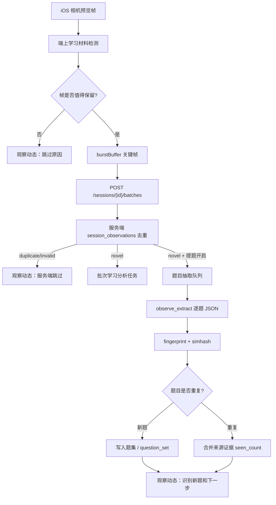

# 智能观察实时提题与题目指纹方案

## 结论

现有代码已经能支撑这件事的主体能力，不需要从零重写。

- 分题/提题能力已经存在：后端有 `/api/sessions/{session_id}/segment-questions`、`/api/sessions/{session_id}/extract-questions`，提示词要求“一题一条”并返回结构化题目。
- 题目级去重已经存在：后端 `_build_observe_response()` 会给每道题追加 `fingerprint` 和 `simhash`，`_consolidate_question_set()` 已按精确指纹与近似 SimHash 合并题集。
- 智能观察省算力链路已经存在：iOS `BurstFrameAnalyzer` 会生成帧指纹、文字 token、学习材料信号；后端 `session_observations` 会二次判断 `novel/duplicate/invalid`，重复画面不会进入批次视觉分析。
- iOS 题目提取模式里已经有实验性自动扫描：`QuestionSegmenter.segment(frame, fast: true)` + `extractScanKey()`，它正是“端上先用题文指纹发现新题，再调后端精提取”的思路。

因此推荐方案是“两级去重”：先按画面去重省模型调用，再按题目指纹去重省入库和展示重复。

## 当前代码地图

```text
ios/PXJ/App/QuestionSegmenter.swift
  QuestionSegmenter.segment(...)
    端上 Vision OCR + 题号锚点，把整页拆成 QuestionRegion。

ios/PXJ/App/ContentView.swift
  BurstFrameAnalyzer
    生成 32x32 灰度帧指纹、OCR token、学习材料信号。
  startBurst / finishBurstFrameAnalysis / flushBurst
    智能观察采样、端上关键帧筛选、批量上传。
  extractScanTick / extractScanKey / extractKeySimilar
    题目提取模式的低成本自动扫描原型。
  ObservationDanmakuOverlay / observationContextDetail
    观察动态与上下文展示入口。

backend/app/main.py
  /api/sessions/{session_id}/batches
    接收智能观察批次，保存图片，按 session_observations 跳过 duplicate/invalid。
  observation_from_meta / best_previous_observation
    服务端帧级去重。
  /api/sessions/{session_id}/extract-questions
    单图结构化提题，写入 question_set。
  _observe_normalize_stem / _observe_simhash
    题目归一化与 SimHash。
  _consolidate_question_set
    题集去重合并。

backend/app/prompts.py
  question_segmentation
    只分割，不解题。
  observe_extract
    逐题抽取题号、学科、题型、题干、选项、填空、图形注记和学生作答。
```

## 目标体验

智能观察运行时，观察动态应该实时看到三类信息：

- 画面层：当前帧是否保留、跳过原因、与上一关键帧的视觉/文字变化。
- 题目层：本帧发现哪些题，哪些是新题，哪些被指纹合并为重复题。
- 下一步：继续观察、建议重拍、已可生成题集/空白卷、可对某题追问或加入错题候选。

示例动态：

```text
保留关键帧 #12：文字 8 处，视觉变化 6.1，进入提题队列。
跳过重复帧 #13：与 #12 视觉距离 1.2，文字变化 0.03。
识别到新题 Q3：fp=4f92c1a8，数学/计算题，已入题集。
合并重复题 Q3：simhash 距离 2，合并到已识别题，来源次数 +1。
下一步：继续慢慢移动试卷，未识别/图形题需要更近更清晰。
```

## v1 版本边界

本版本先交付“端上实时可见 + 停止后异步操作”的闭环：

- 观察中：只对已通过端上关键帧门控的画面做 `fast` 分题扫描，在相机预览上叠加最近一帧的题框和 `fp` 短码；新题高亮，重复题弱化虚线显示。
- 停止后：提示条提供“报告 / 题目 / 错题”三个按钮；报告沿用 `/finish`，题目进入 `/extract-all-questions` 后台队列，错题沿用最终报告里的错题候选解析链路。
- 后端：整轮提题复用单图提题核心逻辑，写同一个 `question_set`，使用 `fingerprint/simhash` 合并；不把普通观察会话改名为“题目提取”。
- 调度：整轮提题走 `task_runs` 的 `question_extraction_session`，后台优先级，不抢实时问答。
- 数据：v1 仍把题集保存在 `report_events(event_type='question_set')`；v2 再落独立 `session_question_observations` 表。

暂不承诺：

- 不做逐帧实时 VLM 识别；实时框只代表端上 OCR/分题候选。
- 不对几何/读图题硬判对错；错题候选以最终报告/分析结果为准。
- 短题、图形题的裁剪图感知哈希属于 v2，v1 对不确定项保守保留和提示重拍。

## 题目指纹怎么做

### v1：文字题指纹

后端已有实现：

1. 从模型返回的 `stem` 取题干。
2. 归一化：小写，去空白、标点、常见中英文符号。
3. 精确指纹：`sha1(normalized_stem)`，返回 40 位十六进制。
4. 近似指纹：对归一化题干做 3-gram SimHash，返回 16 位十六进制。
5. 合并规则：
   - `fingerprint` 完全相同：同题。
   - 否则 `simhash` Hamming 距离 `<= 3`：近似同题。
   - 命中重复时保留第一次进入题集的题目，后续只增加来源证据和观察动态。

这适合绝大多数文字题、计算题、选择题、填空题。

### v2：图形/短题补充指纹

只靠题干文字不够处理这些场景：

- 几何题题干很短，例如“求阴影面积”。
- 题目主要信息在图里。
- OCR 只识别到题号或少量数字。
- 同一页多道短口算题，题干相似度过高。

补充策略：

- `crop_hash`：对题目 bbox 裁剪图做低分辨率感知哈希。
- `layout_key`：页内位置、题号、bbox 比例、附近 OCR token。
- `source_evidence`：保存 `src_filename`、`bbox`、`first_seen_at`、`last_seen_at`、`seen_count`。
- 短题判断：归一化题干少于 8 到 12 字时，不单独信任文字指纹，必须结合 `crop_hash/layout_key`。

推荐合并规则：

```text
if exact_text_fingerprint_hit:
  duplicate
else if simhash_distance <= 3 and normalized_stem_length >= 12:
  duplicate
else if stem_is_short and crop_hash_distance <= threshold and nearby_layout_matches:
  duplicate
else:
  new_question
```

## 低算力策略

### 第一层：端上帧门控

iOS 已经做了这些事：

- 每隔一段时间从相机预览取帧。
- 用 32x32 灰度图生成 `FrameFingerprint`。
- 用 Vision OCR 得到 `textTokens`。
- 用矩形、文字、亮度、纹理、对比度判断是否像学习材料。
- 只有首张、有明显视觉变化、有明显文字变化，或同页间隔抽检时才进入 `burstBuffer`。

新增提题时沿用这层门控：只有被智能观察保留为关键帧的画面，才有资格提题。

### 第二层：服务端帧复核

后端 `/batches` 已把每张图写入 `session_observations`：

- `novel`：新关键帧，可进入批次分析和提题队列。
- `duplicate`：重复观察，跳过模型。
- `invalid`：无关/低质量，跳过模型。

新增提题时只处理 `analysis_image_rows`，也就是服务端确认不重复、不无效的图片。

### 第三层：题目级合并

模型抽取后再用 `fingerprint/simhash` 合并，防止同一道题跨多个关键帧重复入库。

### 调度建议

- 同一会话提题任务最多 1 个 in-flight。
- 每批最多处理 `N` 张新关键帧，建议 v1 为 1 到 3 张。
- 若同页连续停留，只保留间隔抽检，不每秒提题。
- 低质量或无题结果只写动态，不写题集。
- 提题使用 `LLM_PRIORITY_BACKGROUND`，给实时问答让路。

## 推荐架构



## 后端实现建议

### v1 最小实现

复用现有 `/extract-questions` 的核心逻辑，但不要让智能观察直接调用当前接口，因为当前接口会把会话标题改成“题目提取”并把状态置为 `saved`，这会污染普通观察会话。

应抽出一个内部函数：

```python
async def extract_questions_from_stored_image(
    session_id: str,
    filename: str,
    source: str,
    update_session_title: bool = False,
) -> dict:
    ...
```

然后：

- `/extract-questions` 继续用于显式题目提取，`update_session_title=True`。
- `/batches` 对 `analysis_image_rows` 记录一个后台任务，例如 `question_extraction`，`update_session_title=False`。
- 任务完成后更新同一个 `question_set`，并 `emit_log()` 输出新题数、重复题数、指纹前缀和建议。

### v2 数据表

当前 `question_set` 存在 `report_events` 的单条 JSON 里，适合还原页，但不适合实时观察动态与来源证据。建议新增：

```sql
CREATE TABLE session_question_observations (
  id TEXT PRIMARY KEY,
  session_id TEXT NOT NULL,
  question_fingerprint TEXT NOT NULL DEFAULT '',
  simhash TEXT NOT NULL DEFAULT '',
  crop_hash TEXT NOT NULL DEFAULT '',
  normalized_stem TEXT NOT NULL DEFAULT '',
  display_stem TEXT NOT NULL DEFAULT '',
  subject TEXT NOT NULL DEFAULT '',
  qtype TEXT NOT NULL DEFAULT '',
  source_image_id TEXT NOT NULL DEFAULT '',
  src_filename TEXT NOT NULL DEFAULT '',
  bbox_json TEXT NOT NULL DEFAULT '{}',
  first_seen_at TEXT NOT NULL,
  last_seen_at TEXT NOT NULL,
  seen_count INTEGER NOT NULL DEFAULT 1,
  status TEXT NOT NULL DEFAULT 'new',
  created_at TEXT NOT NULL,
  updated_at TEXT NOT NULL
);
```

索引：

```sql
CREATE INDEX idx_session_question_fp
ON session_question_observations(session_id, question_fingerprint);

CREATE INDEX idx_session_question_seen
ON session_question_observations(session_id, last_seen_at DESC);
```

## iOS 实现建议

### 复用自动扫描原型

把当前题目提取模式的 `extractScanTick()` 思路拆成通用能力：

```swift
ObservationQuestionScanner.scan(frame) -> [ObservationQuestionCandidate]
```

智能观察模式中，只在 `finishBurstFrameAnalysis()` 接受关键帧后做轻量扫描：

- 有新端上 key：动态显示“发现疑似新题，等待服务端确认”。
- 没有新 key：不触发提题，只继续观察。
- 服务端返回结果后，以服务端 `fingerprint/simhash` 为准更新 UI。

### 观察动态状态

新增轻量状态：

```swift
struct ObservationQuestionStatus {
    var queuedFrameCount: Int
    var extractedQuestionCount: Int
    var uniqueQuestionCount: Int
    var duplicateQuestionCount: Int
    var lastFingerprintPrefix: String
    var lastAction: String
}
```

展示位置：

- `runtimeTasks` 的“智能观察运行中”详情加上：`识别题集 X 道，新题 Y，道重复合并 Z 道`。
- `observationContextDetail()` 加上最近 4 条题目动态。
- `ObservationDanmakuOverlay` 继续复用 `logs.suffix(6)`，但提题日志要更短、更适合实时看。

## 动态文案规范

推荐固定几种事件，避免观察动态刷屏：

```text
关键帧保留：#12 文字8处，视觉变化6.1，准备识别题目。
重复帧跳过：#13 与上一关键帧相似，未消耗模型。
题目识别中：#12 已进入后台提题队列。
新题入库：Q3 数学/计算题，fp=4f92c1a8，题集共 7 道。
重复合并：Q3 simhash 距离2，合并到已识别题。
需要重拍：题干/图形不清楚，靠近并保持 1 秒。
下一步：继续移动到下一题，或点题目追问。
```

## 验收标准

- 同一页连续观察 10 到 20 秒，重复帧不会频繁触发模型。
- 同一题跨多张照片只在题集中出现一次。
- 画面移动到新题时，观察动态能在 1 到 3 秒内显示“发现/排队/识别/合并”的状态。
- 题集 JSON 中每题都有 `fingerprint`、`simhash`、`src_filename`。
- 低质量、无关画面、重复画面都能显示跳过原因。
- 几何/短题不会因为纯文字相似被错误合并；不确定时保留来源证据并提示重拍。
- 停止观察后，三个按钮都进入异步路径：报告生成、整轮题目提取、错题候选整理；任务可在后台任务浮层看到排队/生成中状态。
- 实时叠层不遮挡主要题干：题框透明、短码小标签，重复题弱化显示；停止或新观察开始时清空旧框。

## AB 与灰度指标

- A 组：只显示现有观察动态，不显示实时题框；停止后仍可手动生成报告。
- B 组：显示实时题框和 `fp` 短码，并开放“报告 / 题目 / 错题”按钮。
- 成功指标：题目重复率下降、用户停止后点击提题比例、题目提取成功率、平均排队时长、低质量重拍率。
- 护栏指标：实时问答平均等待时间不能明显升高；`LLM_PRIORITY_BACKGROUND` 队列不能长期堆积；iOS 观察时 CPU/耗电不能出现明显异常。

## 推荐落地顺序

1. 抽后端提题核心函数，避免智能观察复用 `/extract-questions` 时改会话状态和标题。
2. 在 `/batches` 增加可配置的观察提题后台任务，只处理 `novel` 关键帧。
3. 在任务完成后写 `question_set`，并通过 `emit_log()` 输出新题/重复/指纹动态。
4. iOS `runtimeTasks` 和观察上下文显示题目计数、最近指纹和下一步。
5. 增加 `session_question_observations` 表，保存来源证据、seen_count、短题 crop_hash。
6. 为历史照片和模拟器测试补一组“重复场景、多张同题、新题切换”的用例。
